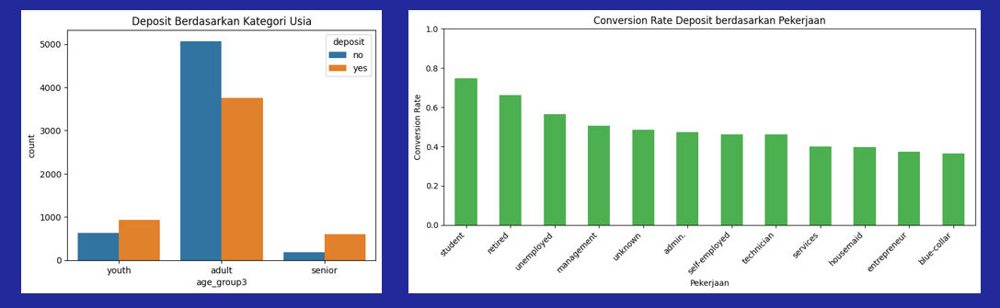
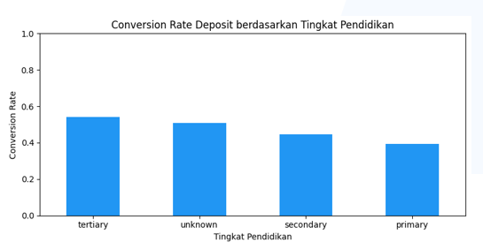
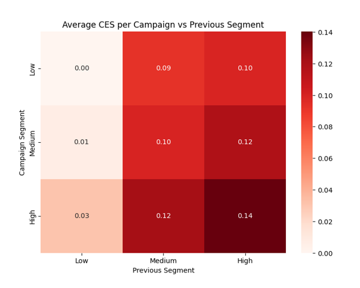

# 🏦 Optimalisasi Strategi Pemasaran Deposit Berjangka

Analisis data nasabah bank untuk mengidentifikasi segmen paling potensial
membuka deposito berjangka, guna meningkatkan efektivitas kampanye pemasaran.

## 📌 Latar Belakang
Strategi pemasaran deposit berjangka masih didominasi pendekatan konvensional
yang membutuhkan biaya besar namun menghasilkan tingkat konversi rendah (±10%).
Dengan memanfaatkan data nasabah yang tersedia, bank dapat mengidentifikasi
target yang lebih potensial sehingga strategi pemasaran menjadi lebih efektif
dan efisien.

## 🎯 Tujuan Analisis
- Mengidentifikasi profil nasabah yang paling berpotensi membuka deposit
- Menemukan faktor utama yang memengaruhi keputusan nasabah
- Memberikan rekomendasi strategi pemasaran yang lebih efektif

## 📊 Dataset
| Detail | Keterangan |
|---|---|
| Nama Dataset | Bank Marketing |
| Jumlah Observasi | 11.162 nasabah |
| Jumlah Variabel | 17 variabel |
| Target Variabel | Deposit (Yes/No) |

## 🛠️ Metodologi

**1. Data Understanding** — memahami struktur & konteks data

**2. Data Preparation**
- Standarisasi nilai `unknown` & `999` → NaN
- Membagi kategori <10%, 10–50%, >50%
- `pdays = 999` → -1 (belum pernah dihubungi)
- Konversi tipe data object → category
- Cek duplikat (hasil: 0) & outlier (metode IQR)

**3. Data Manipulation**
- Menangani data leakage pada kolom `duration`
- Encoding kategori & menyamakan format huruf
- Pengelompokan usia (youth/adult/senior) dan saldo (low/medium/high)
- Encoding variabel target (respon deposit)

**4. Exploratory Data Analysis (EDA)** — lihat bagian Insight di bawah

## 🔎 Insight Utama

### 1. Profil Nasabah Potensial


Nasabah usia dewasa hingga menjelang pensiun memiliki kecenderungan lebih
tinggi membuka deposit. Dari sisi pekerjaan, segmen **student** dan
**retired** menunjukkan conversion rate tertinggi.

### 2. Faktor Finansial


Nasabah yang membuka deposit cenderung memiliki saldo (balance) lebih tinggi.
Nasabah tanpa housing loan juga menunjukkan conversion rate lebih besar —
menegaskan bahwa kemampuan finansial dan rendahnya beban pinjaman
meningkatkan minat membuka deposit.

### 3. Faktor Sosial


Nasabah berpendidikan **tertiary** memiliki conversion rate pembukaan
deposit tertinggi.

### 4. Campaign Effectiveness Score (CES)


Kampanye paling efektif terjadi pada kombinasi intensitas kampanye tinggi
dan segmen pelanggan sebelumnya berkualitas tinggi (CES ≈ 0,14). Ini
menegaskan bahwa keberhasilan kampanye ditentukan oleh keselarasan antara
intensitas dan kualitas segmen, bukan frekuensi semata.

## ✅ Hasil
Pembukaan deposito lebih banyak dilakukan oleh nasabah dewasa dengan kondisi
finansial stabil, tanpa pinjaman aktif, dan karakteristik pekerjaan
tertentu. Keputusan nasabah dipengaruhi oleh faktor demografis dan
finansial, sehingga pendekatan pemasaran berbasis segmentasi menjadi lebih
efektif.

## 💡 Rekomendasi
- Fokuskan pemasaran pada nasabah dewasa dengan kondisi finansial stabil
- Prioritaskan segmen pendidikan dan pekerjaan dengan tingkat konversi tinggi
- Targetkan nasabah tanpa pinjaman aktif
- Optimalkan kampanye melalui segmentasi yang tepat dan frekuensi kontak
  yang efisien

## 🧰 Tools & Library
- Python (Pandas, NumPy)
- Matplotlib / Seaborn
- Jupyter Notebook

## 📁 Struktur Folder
```
├── notebook.ipynb          # notebook analisis lengkap
├── data/                    # dataset (atau link sumber jika file besar)
├── images/                  # gambar chart untuk README
└── README.md
```

## 📬 Kontak
**Eka Puspitasari**
[LinkedIn](https://www.linkedin.com/in/ekapuspitasari10/) • ekapuspitaaari10@gmail.com
```

